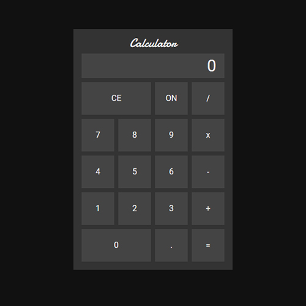

# Calculator

## Overview
- Simple Calculator app
- HTML, CSS, and vanilla Javascript
- Webpack for bundling
- Jest for testing

## Other Notes
- By using objects for operandOne and operandTwo, I can just pass around a reference,
and avoid writing the same code twice with different variables
- You can chain, ex. 5 x 5 x 5
- Only update methods change state